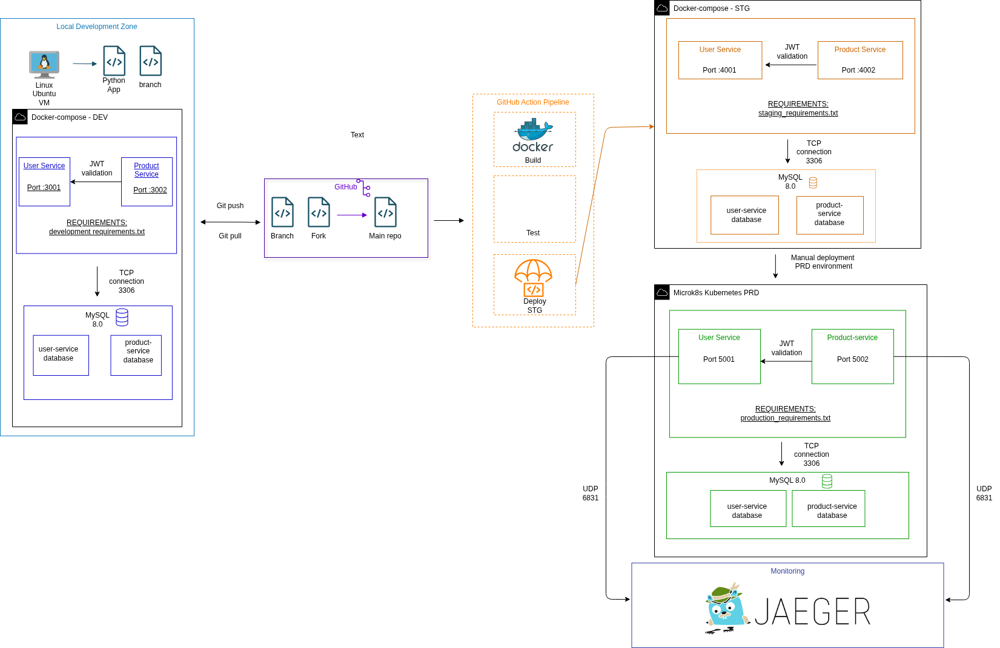
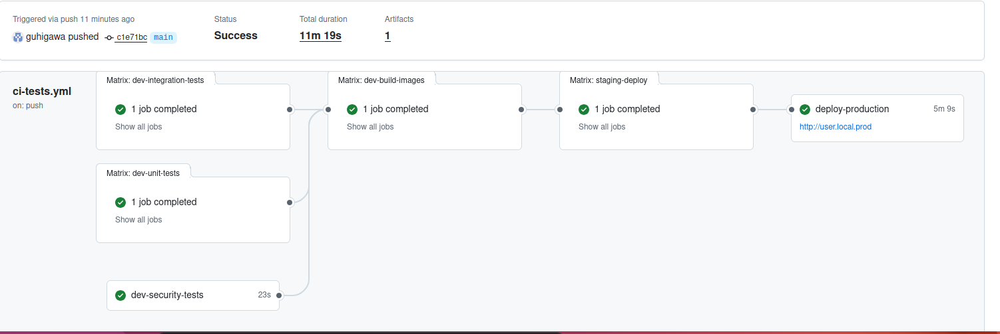
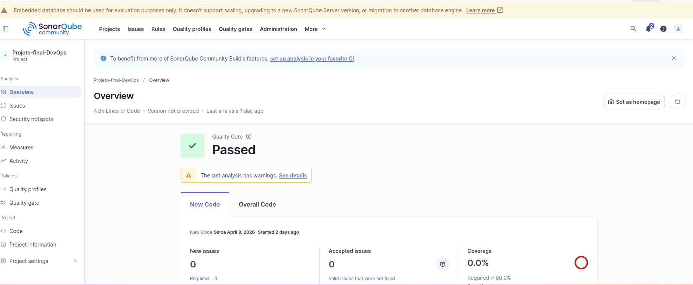
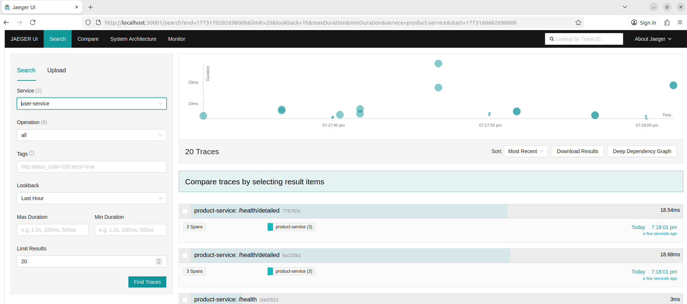
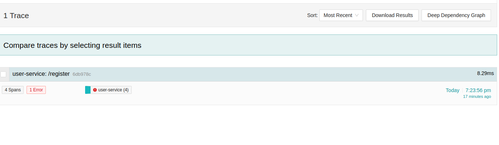
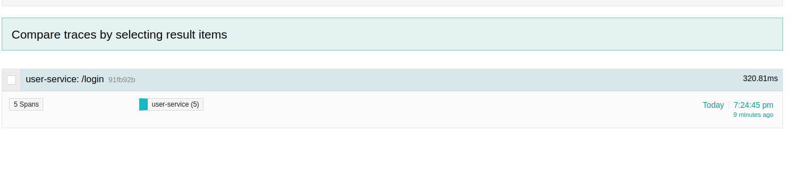
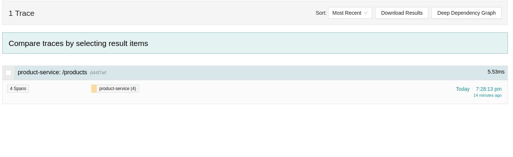

## 1.INTRODUÇÃO
### A Startup: "Inventory"
A **Inventory** é uma startup que oferece uma plataforma simplificada para pequenos vendedores gerenciarem seu catálogo de produtos de forma segura e organizada.

### Para o Usuário Final (Vendedor)

- **Registro**: Registre-se na plataforma com email e senha
- **Gerencie seu catálogo**: Adicione, edite e remova produtos do seu estoque
- **Controle seu perfil**: Atualize seus dados pessoais
- **Acesso seguro**: Todas as operações são protegidas por autenticação JWT

### Funcionalidades Principais

| Serviço | Funcionalidade | Endpoint |
|---------|----------------|----------|
| **User Service** | Registro de vendedores | `POST /register` |
| **User Service** | Autenticação | `POST /login` |
| **User Service** | Gerenciamento de perfil | `GET/PUT /profile` |
| **Product Service** | Criar produto | `POST /products` |
| **Product Service** | Listar produtos | `GET /products` |
| **Product Service** | Atualizar produto | `PUT /products` |
| **Product Service** | Remover produto | `DELETE /products` |

### Como Usar na Prática

1. **Usuário**, acessa a plataforma e cria sua conta
2. **Usuário faz login** e recebe um token de acesso
3. **Usuário adiciona seus produtos** ao catálogo (nome, preço, quantidade)
4. **Usuário pode editar** produtos existentes ou removê-los do estoque
5. **Usuário ode atualizar** seus dados pessoais no perfil
6. **Todas as operações** são rastreadas via Jaeger, permitindo à startup identificar possíveis gargalos

### Arquitetura Técnica

Este projeto implementa uma arquitetura de microsserviços com **Python/Flask** e **MySQL**, containerizada com **Docker** e orquestrada com **Kubernetes (MicroK8s)**. O pipeline CI/CD é automatizado com **GitHub Actions**, incluindo testes unitários, de integração e funcionais. O monitoramento é realizado com **Jaeger** para tracing distribuído entre os microsserviços, permitindo rastrear cada requisição desde o login até a gestão de produtos.

### Interação entre Microsserviços

Os serviços interagem da seguinte forma:
- O **Product Service** depende do **User Service** para autenticação
- Quando um vendedor tenta criar/editar/remover um produto, o Product Service valida o token JWT com o User Service
- Isso garante que cada vendedor só acesse seus próprios produtos (isolamento de dados)


*Figura 1: Diagrama de Arquitetura do Projeto*

### Componentes Principais:
- **User Service**: Gerenciamento de usuários (registro, login, perfil)
- **Product Service**: Gerenciamento de produtos (CRUD)
- **MySQL**: Bancos de dados separados por serviço
- **Jaeger**: Tracing distribuído entre microsserviços
- **Kubernetes**: Orquestração em produção com HPA e Rolling Updates

## 2. REPOSITÓRIO

O projeto está hospedado em um repositório **público** no GitHub:
[https://github.com/guhigawa/Projeto-final-DevOps.git](https://github.com/guhigawa/Projeto-final-DevOps.git)

### Justificativa para a Startup
- **Acesso imediato**: Qualquer membro da equipe pode clonar e começar a trabalhar
- **Transparência**: Código aberto facilita auditoria e revisão de código
- **Portfólio**: Demonstra boas práticas de desenvolvimento para futuros clientes
- **Custo zero**: GitHub Actions gratuito para repositórios públicos

### Segurança
Apesar de público, **nenhuma credencial sensível** está no repositório:
- Secrets utilizam GitHub Secrets
- Senhas de banco via variáveis de ambiente
- Tokens JWT injetados no deploy

---

## 3. Tecnologias Utilizadas

| Categoria | Tecnologias |
|-----------|------------|
| **Backend** | Python 3.10/3.11, Flask, JWT |
| **Banco de Dados** | MySQL 8.0 |
| **Containerização** | Docker, Docker Compose |
| **Orquestração** | Kubernetes (MicroK8s) |
| **CI/CD** | GitHub Actions |
| **Monitoramento** | Jaeger, OpenTelemetry |
| **Testes** | Pytest, Coverage |
| **Infraestrutura** | Ubuntu 22.04 |

## 4. Estrutura de Diretórios
Projeto_final
.
├── actions-runner
├── .bandit
├── docker-compose.sonarqube.yml
├── docker-compose.staging.yml
├── docker-compose.yml
├── .dockerignore
├── documentation
├── .env
├── .env.staging
├── generate_hashed_password.py
├── .git
├── .github
├── .gitignore
├── k8s
├── Makefile
├── monitoring
├── product-service
├── .pytest_cache
├── README.md
├── requirements
├── requirements.txt.backup
├── scripts
├── .sonar
├── sonar-project.properties
├── tests
├── .trivyignore
├── user-service
├── .venv
└── .vscode

## 4.1 Comandos Makefile Disponíveis

O projeto utiliza um Makefile para automatizar tarefas comuns:

| Comando | Descrição |
|---------|-----------|
| `make setup` | Cria `.venv` e instala dependências |
| `make dev` | Sobe ambiente DEV (Docker Compose) |
| `make staging` | Sobe ambiente STAGING |
| `make prod` | Deploy para produção (K8s) |
| `make test-unit` | Executa testes unitários (55 testes) |
| `make test-integration` | Executa testes de integração (30 testes) |
| `make test-functional` | Executa testes funcionais (11 testes) |
| `make test-all` | Executa TODOS os testes (96 testes) |
| `make test-security` | Executa testes de segurança (Bandit, Safety, pip-audit) |
| `make test-security-trivy` | Escaneia containers com Trivy |
| `make sonar-start` | Inicia SonarQube local |
| `make sonar-stop` | Para SonarQube local |
| `make sonar-scan` | Executa análise SonarQube |
| `make clean` | Limpa arquivos de cache (`__pycache__`, `.pytest_cache`) |
| `make clean-containers` | Para containers DEV + STAGING |
| `make clean-images-prod` | Remove imagens da build de PRD |
| `clean-prod-keep-data` | Remove pods e serviços mas mantém PVC |
| `make clean-prod` | Remove recursos do Kubernetes |
| `make clean-all` | Limpa TUDO (cache + containers + K8s) |
| `make zip` | Cria ZIP para entrega |

## 5. Configuração e Acesso aos Ambientes

### 5.1 Pré-requisitos

Antes de começar, certifique-se de ter instalado:
- Docker e Docker Compose
- Python 3.10+
- Make
- Git
- (Opcional) MicroK8s para ambiente de produção

### 5.2 Configuração Inicial

```bash
# 1. Clonar o repositório
git clone https://github.com/guhigawa/Projeto-final-DevOps.git
cd Projeto-final-DevOps

# 2. Criar ambiente virtual e instalar dependências
make setup

# 3. Ativar o ambiente virtual
source .venv/bin/activate
```
### 5.3 Variáveis de Ambiente

#### 5.3.1 Ambiente DEV

Crie um arquivo .env na raiz do projeto com o seguinte conteúdo (ajuste os valores conforme necessário):
```
# Ambiente
ENV=development

# JWT Authentication (defina uma chave secreta forte)
SECRET_KEY=your_secret_key_here

# Portas
USER_MYSQL_PORT=3306
USER_PORT=3001
PRODUCT_MYSQL_PORT=3306
PRODUCT_PORT=3002

# User Service Database
USER_MYSQL_HOST=mysql-user
USER_MYSQL_USER=your_db_user
USER_MYSQL_PASSWORD=your_db_password
USER_MYSQL_DB=your_db_name

# Product Service Database  
PRODUCT_MYSQL_HOST=mysql-product
PRODUCT_MYSQL_USER=your_product_db_user
PRODUCT_MYSQL_PASSWORD=your_product_db_password
PRODUCT_MYSQL_DB=your_product_db_name

# Service URLs
USER_SERVICE_URL=http://user-service:3001
PRODUCT_SERVICE_URL=http://product-service:3002
```
#### 5.3.2 Ambiente STG

Crie um arquivo .env.staging na raiz do projeto:
```
# Ambiente
ENV=staging

# Portas
STAGING_USER_PORT=4001
STAGING_PRODUCT_PORT=4002
STAGING_USER_MYSQL_PORT=4308
STAGING_PRODUCT_MYSQL_PORT=4309
STAGING_MYSQL_PORT=3306

# Base de dados User
STAGING_USER_MYSQL_USER=your_staging_user
STAGING_USER_MYSQL_PASSWORD=your_staging_password
STAGING_USER_MYSQL_DB=user_staging

# Base de dados Product
STAGING_PRODUCT_MYSQL_USER=your_staging_product_user
STAGING_PRODUCT_MYSQL_PASSWORD=your_staging_product_password
STAGING_PRODUCT_MYSQL_DB=product_staging

# Segurança (defina uma chave secreta forte)
STAGING_SECRET_KEY=your_staging_secret_key

# URLs dos serviços
USER_SERVICE_URL=http://user-service:4001
PRODUCT_SERVICE_URL=http://product-service:4002
```
Nota: Os valores acima são exemplo. Para produção, utilize credenciais seguras. Os arquivos .env e .env.staging com valores reais estão incluídos no ZIP de entrega.

### 5.4 Ambiente de Desenvolvimento (DEV)

Comando para iniciar:
```
make dev
```
Acesso aos serviços:

| Serviço | URL | Endpoint de teste |
|---------|-----|-------------------|
| User Service | http://localhost:3001 | curl http://localhost:3001/health |
| Product Service | http://localhost:3002 | curl http://localhost:3002/health |

Exemplo de uso da API:
```
# 1. Registar um novo user
curl -X POST http://localhost:3001/register \
  -H "Content-Type: application/json" \
  -d '{"email": "vendedor@exemplo.com", "password": "StrongPass123!"}'

# 2. Fazer login (obter token JWT)
TOKEN=$(curl -X POST http://localhost:3001/login \
  -H "Content-Type: application/json" \
  -d '{"email": "vendedor@exemplo.com", "password": "StrongPass123!"}' \
  | jq -r .token)

# 3. Criar um produto (usando o token obtido)
curl -X POST http://localhost:3002/products \
  -H "Authorization: Bearer SEU_TOKEN_AQUI" \
  -H "Content-Type: application/json" \
  -d '{"name": "Produto Exemplo", "price": 29.99, "quantity": 10, "description": "Descrição do produto"}'

# 4. Listar produtos do vendedor
curl -X GET http://localhost:3002/products \
  -H "Authorization: Bearer SEU_TOKEN_AQUI"
```

Parar o ambiente
```
make clean
make clean-containers
```

### 5.5 Ambiente de Staging (STG)

Comando para iniciar:

```
make staging
```

Acesso aos serviços:

| Serviço | URL | Endpoint de teste |
|---------|-----|-------------------|
| User Service | http://localhost:4001 | curl http://localhost:4001/health |
| Product Service | http://localhost:4002 | curl http://localhost:4002/health |

Testes no ambiente staging:

```
# Executar testes funcionais
make test-functional

# Executar testes de segurança
make test-security
```

Parar o ambiente

```
make clean
make clean-containers
```

### 5.6 Ambiente de Produção (PRD)

Pré-requisitos para produção:
```
# Verificar se o MicroK8s está instalado e ativo
microk8s status --wait-ready

# Habilitar addons necessários (executar uma única vez)
microk8s enable registry dns ingress metrics-server
```

Comando para deploy:
```
make prod
```

Acesso aos serviços em produção:

Para aceder aos serviços, adicione as seguintes entradas ao ficheiro /etc/hosts:
```
echo "127.0.0.1 user.local.prod product.local.prod" | sudo tee -a /etc/hosts
```

Endpoints disponíveis:
| Serviço | URL | Endpoint de teste |
|---------|-----|-------------------|
| User Service | http://user.local.prod | curl http://user.local.prod/health|
| Product Service | http://product.local.prod | curl http://product.local.prod/health |

Verificar o estado dos pods
```
microk8s kubectl get pods -n projeto-final
microk8s kubectl get svc -n projeto-final
microk8s kubectl get hpa -n projeto-final
```

Limpeza do ambiente de produção:
```
make clean-prod
```

## 5.7 Resumo dos Comandos por Ambiente

| Ambiente | Iniciar | Testar | Parar|
|----------|------------|--------|---------|
| **DEV** | make dev | make test-unit | make clean-containers |
| **STG** | make staging | make test-functional | make clean-containers |
| **PRD** | make prod | curl http://user.local.prod/health | make clean-prod |

### 5.8 Exemplo Completo de Utilização da API

```
# === PASSO 1: Iniciar ambiente DEV ===
make dev

# === PASSO 2: Registar vendedor ===
curl -X POST http://localhost:3001/register \
  -H "Content-Type: application/json" \
  -d '{"email": "loja@inventario.com", "password": "Admin123!"}'

# === PASSO 3: Login ===
TOKEN=$(curl -s -X POST http://localhost:3001/login \
  -H "Content-Type: application/json" \
  -d '{"email": "loja@inventario.com", "password": "Admin123!"}' \
  | jq -r .token)

echo "Token: $TOKEN"

# === PASSO 4: Adicionar produtos ===
curl -X POST http://localhost:3002/products \
  -H "Authorization: Bearer $TOKEN" \
  -H "Content-Type: application/json" \
  -d '{"name": "Produto 1", "price": 19.99, "quantity": 50}'

curl -X POST http://localhost:3002/products \
  -H "Authorization: Bearer $TOKEN" \
  -H "Content-Type: application/json" \
  -d '{"name": "Produto 2", "price": 39.99, "quantity": 30}'

# === PASSO 5: Listar produtos ===
curl -X GET http://localhost:3002/products \
  -H "Authorization: Bearer $TOKEN" | jq .

# === PASSO 6: Limpar ambiente ===
make clean
make clean-containers
```

### 5.9 Limpeza de Ambientes

O projeto oferece diferentes níveis de limpeza:

| Comando | O que faz | Quando usar |
|---------|-----------|-------------|
| `make clean` | Remove ficheiros temporários (__pycache__, .pytest_cache, .coverage) | Após testes |
| `make clean-containers` | Remove containers DEV e STAGING + pastas de testes | Quando terminar de usar DEV/STG |
| `make clean-images-prod` | Remove imagens do build de produção (localhost:32000/*) | Para libertar espaço no registry |
| `make clean-prod-keep-data` | Remove pods e serviços do K8s, mas mantém os volumes (PVC) | Quando quer recriar apenas os serviços |
| `make clean-prod` | Remove todos os recursos do Kubernetes (namespace completo) | Para destruir completamente a produção |
| `make clean-all` | Executa todos os comandos de limpeza acima | Para uma limpeza completa do projeto |

**Explicação dos comandos de produção:**
- `clean-prod-keep-data`: Útil quando os dados (MySQL) precisam ser preservados
- `clean-images-prod`: Limpa as imagens do registry local do MicroK8s
- `clean-prod`: Remove tudo, incluindo os volumes de dados

**Exemplo de uso:**
```bash
# Limpeza rápida (apenas caches)
make clean

# Limpeza de produção mantendo dados
make clean-prod-keep-data

# Limpeza completa de produção
make clean-prod

# Limpeza total do projeto
make clean-all

## 6. Pipeline CI/CD


*Figura 2: Pipeline automatizada no GitHub Actions*

### Jobs do Pipeline:

| Job | Ambiente | Descrição |
|-----|----------|-----------|
| `dev-unit-tests` | DEV | Testes unitários |
| `dev-integration-tests` | DEV | Testes de integração |
| `dev-build-images` | DEV | Build e push para Docker Hub |
| `staging-deploy` | STG | Deploy + testes funcionais + testes segurança |
| `deploy-production` | PRD | Deploy no Kubernetes (self-hosted) |

### Fluxo do Pipeline
[Push/PR] → [dev-unit-tests] → [dev-integration-tests] → [dev-build-images] → [staging-deploy + security testes] → [deploy-production]

### Ferramentas de Segurança no STG

| Ferramenta | Finalidade | Falha se... |
|------------|------------|--------------|
| **Bandit** | Análise de segurança do código | Encontrar HIGH severity |
| **Safety** | Vulnerabilidades em bibliotecas | Encontrar vulnerabilidades |
| **pip-audit** | Auditoria de dependências | Encontrar vulnerabilidades |
| **Trivy** | Vulnerabilidades em containers | Encontrar CRITICAL |
| **SonarQube** | Qualidade de código | Apenas análise (não falha) |

O deploy em produção utiliza um **self-hosted runner** configurado na VM com MicroK8s. O job baixa as imagens construídas no DEV e realiza o deploy no Kubernetes.

```bash
# Verificar status em produção
microk8s kubectl get pods -n projeto-final
curl http://user.local.prod/health
curl http://product.local.prod/health

```

## 7. Testes manuais e Testes automatizados

| Tipo | Quantidade | Status | Comando |
|------|------------|--------|---------|
| Testes unitários | 55 | ok | `make test-unit` |
| Testes de integração | 30 | ok | `make test-integration` |
| Testes funcionais | 11 | ok | `make test-functional` |
| **TOTAL** | **96** | ok | `make test-all` |

### 7.1 Testes de Segurança

### Testes de Segurança

O projeto inclui testes de segurança automatizados:

```bash
make test-vulnerability
```

| Ferramenta | Finalidade | Comando |
|------------|------------|---------|
| **Bandit** | Análise de segurança do código | `bandit -c .bandit -r user-service/ product-service/` |
| **Safety** | Vulnerabilidades em bibliotecas | `safety check -r requirements/staging_requirements.txt` |
| **pip-audit** | Auditoria de dependências | `pip-audit -r requirements/staging_requirements.txt` |
| **Trivy** | Vulnerabilidades em containers | `trivy image --severity CRITICAL,HIGH, MEDIUM <image>` |
| **SonarQube** | Qualidade de código | Executado no CI |

### Principais resultados
- Bandit: Nenhuma vulnerabilidade HIGH
- Safety: Nenhuma vulnerabilidade
- pip-audit: Nenhuma vulnerabilidade
- Trivy: Vulnerabilidades do sistema base 
- SonarQube: Análise disponível em http://localhost:9000


*Figura 3: Sonarqube overview*

## 8. Monitoramento com Jaeger
O Projeto utilzar Jaeger para rastrear a requisição de serviços
env:
- name: JAEGER_AGENT_HOST
  value: "jaeger.monitoring.svc.cluster.local"
- name: JAEGER_AGENT_PORT
  value: "6831"
- name: OTEL_SERVICE_NAME
  value: "user-service"  # ou "product-service"

# IP do servidor
NODE_IP=$(microk8s kubectl get node -o jsonpath='{.items[0].status.addresses[0].address}')

# URL do Jaeger UI
echo "Jaeger UI: http://$NODE_IP:30001"

Funcionalidades Implementadas
Tracing automático com OpenTelemetry

Spans para cada operação (validação, queries SQL, etc.)

Correlação entre serviços

Identificação de gargalos e erros

# Evidencias de funcionamento





## 9. Evidências de Funcionamento
### 9.1 Kubernetes - Pods Rodando
(venv) ubuntu@ubuntu-2204:~/Downloads/Projeto_final$ microk8s kubectl get all -n projeto-final
NAME                                  READY   STATUS    RESTARTS       AGE
pod/mysql-product-0                   1/1     Running   25 (95m ago)   17d
pod/mysql-user-0                      1/1     Running   29 (95m ago)   22d
pod/product-service-dfcbc566c-4zz8f   1/1     Running   8 (95m ago)    4d1h
pod/product-service-dfcbc566c-w57lt   1/1     Running   8 (95m ago)    4d1h
pod/user-service-5957b547bf-q8q5v     1/1     Running   8 (95m ago)    4d1h
pod/user-service-5957b547bf-r4zj4     1/1     Running   0              93m

NAME                      TYPE        CLUSTER-IP      EXTERNAL-IP   PORT(S)    AGE
service/mysql-product     ClusterIP   None            <none>        3306/TCP   22d
service/mysql-user        ClusterIP   None            <none>        3306/TCP   22d
service/product-service   ClusterIP   10.152.183.31   <none>        5002/TCP   18d
service/user-service      ClusterIP   10.152.183.64   <none>        5001/TCP   21d

NAME                              READY   UP-TO-DATE   AVAILABLE   AGE
deployment.apps/product-service   2/2     2            2           18d
deployment.apps/user-service      2/2     2            2           21d

NAME                                         DESIRED   CURRENT   READY   AGE
replicaset.apps/product-service-5694886577   0         0         0       4d2h
replicaset.apps/product-service-584d59689f   0         0         0       18d
replicaset.apps/product-service-6c6f9bbf8b   0         0         0       15d
replicaset.apps/product-service-6d96fc5688   0         0         0       4d2h
replicaset.apps/product-service-dfcbc566c    2         2         2       4d1h
replicaset.apps/user-service-574fc57b47      0         0         0       4d2h
replicaset.apps/user-service-5957b547bf      2         2         2       4d1h
replicaset.apps/user-service-6466bfb6d       0         0         0       4d2h
replicaset.apps/user-service-6696bd4bbd      0         0         0       4d2h
replicaset.apps/user-service-77b68d89cb      0         0         0       16d
replicaset.apps/user-service-85d578bb84      0         0         0       16d
replicaset.apps/user-service-c67d55bb6       0         0         0       21d

NAME                             READY   AGE
statefulset.apps/mysql-product   1/1     17d
statefulset.apps/mysql-user      1/1     22d

NAME                                                      REFERENCE                    TARGETS                        MINPODS   MAXPODS   REPLICAS   AGE
horizontalpodautoscaler.autoscaling/product-service-hpa   Deployment/product-service   cpu: 2%/80%, memory: 19%/80%   2         5         2          18d
horizontalpodautoscaler.autoscaling/user-service-hpa      Deployment/user-service      cpu: 1%/70%, memory: 17%/80%   2         5         2          21d

### 9.2 HPA - Auto Scaling
(venv) ubuntu@ubuntu-2204:~/Downloads/Projeto_final$  microk8s kubectl get hpa -n projeto-final
NAME                  REFERENCE                    TARGETS                        MINPODS   MAXPODS   REPLICAS   AGE
product-service-hpa   Deployment/product-service   cpu: 2%/80%, memory: 19%/80%   2         5         2          18d
user-service-hpa      Deployment/user-service      cpu: 2%/70%, memory: 17%/80%   2         5         2          21d

### 9.3 Ingress - Acesso aos Serviços
(venv) ubuntu@ubuntu-2204:~/Downloads/Projeto_final$ curl http://user.local.prod/health
{"status":"healthy"}
(venv) ubuntu@ubuntu-2204:~/Downloads/Projeto_final$ curl http://product.local.prod/health
{"status":"healthy"}

## 10. Problemas Enfrentados e Soluções
### 10.1 Docker Compose - Ordem de Inicialização
Problema | Solução	|  Lição Aprendida
Serviços Flask iniciavam antes do MySQL estar pronto | Implementação de health checks no docker-compose e verificação em loop | Containers não iniciam na ordem especificada; é preciso garantir dependências com depends_on + condition: service_healthy

### 10.2 Banco de Dados - Privilégios no Staging
Problema | Solução	|  Lição Aprendida
Erro Access denied for user 'product_user'@'%' | Correção manual de privilégios e ajuste nos scripts de inicialização | Scripts SQL precisam ser idempotentes; variáveis do docker-compose não funcionam dentro de scripts SQL

### 10.3 GitHub Actions - Secrets em Pull Requests
Problema | Solução	|  Lição Aprendida
PRs não tinham acesso aos secrets, quebrando o pipeline	| Implementação de sistema de fallback com valores padrão para PRs | Pipelines precisam ser resilientes; usar || para fallbacks em múltiplas camadas

### 10.4 Kubernetes - Exit Code 137 (OOMKilled)
Problema | Solução	|  Lição Aprendida
Pods reiniciando com exit code 137 | Ajuste dos valores de initialDelaySeconds nas probes de liveness/readiness | Exit code 137 indica que o processo foi morto (OOM ou probe failure); probes muito agressivas causam restart loop

### 10.5 Kubernetes - Imagens não atualizavam
Problema | Solução	|  Lição Aprendida
Mesma tag 1.0.0 não forçava pull da nova imagem | imagePullPolicy: Always + kubectl rollout restart | Kubernetes cacheia imagens com mesma tag; usar latest é anti-pattern, mas Always resolve para desenvolvimento

### 10.6 Jaeger - Traces não apareciam
Problema | Solução	|  Lição Aprendida
Serviços não enviavam traces para o Jaeger | Correção do protocolo UDP no Service e adição das variáveis de ambiente | Protocolo UDP deve ser explicitamente definido; DNS interno deve seguir padrão servico.namespace.svc.cluster.local

### 10.7 Variáveis de Ambiente - Inconsistência
Problema | Solução	|  Lição Aprendida
Nomes de variáveis diferentes entre statefulset, configmap e código	| Padronização de nomenclatura e documentação | Consistência é crítica; usar mesma variável em todos os lugares

## 11. Lições Aprendidas e Pontos-Chave
### 11.1 Arquitetura de Testes
text
DEV (Local)      - Testes unitários e validadores (rápidos)
STAGING (Docker) - Testes de integração e funcionais (ambiente real)
PROD (K8s)       - Health checks e tracing (validação de deploy)

### 11.2 Segurança em Múltiplas Camadas
python
# Inseguro: confia no input do usuário
@app.route("/users/<user_id>")
def get_user(user_id):
    cursor.execute("SELECT * FROM users WHERE id = %s", (user_id,))

# Seguro: usa ID do token decodificado
@token_required
def get_user(current_user_id):
    cursor.execute("SELECT * FROM users WHERE id = %s", (current_user_id,))

### 11.3 Idempotência em Scripts SQL
sql
-- Perigoso: falha se tabela já existe
CREATE TABLE users (...);

-- Idempotente: só cria se não existir
CREATE TABLE IF NOT EXISTS users (...);

### 11.4 Debugging em Kubernetes
bash
# Sequência de debug quando algo não funciona
kubectl describe pod <pod>          # 1. Ver eventos
kubectl logs <pod>                   # 2. Ver logs
kubectl exec -it <pod> -- /bin/bash  # 3. Entrar no pod
kubectl get endpoints                 # 4. Ver se service tem endpoints
kubectl get svc                       # 5. Ver IPs dos serviços
### 11.5 Estratégia de Probes
yaml

# Liveness: "Estou vivo" → Reinicia se falhar
livenessProbe:
  initialDelaySeconds: 45  # Dê tempo para app iniciar
  periodSeconds: 15        # Não sobrecarregue

# Readiness: "Estou pronto para tráfego" → Remove do load balancer
readinessProbe:
  initialDelaySeconds: 10  # Mais agressivo
  periodSeconds: 5         # Verifica frequente

### 11.6 OpenTelemetry - Boas Práticas
python
# Sempre adicionar atributos relevantes
span.set_attribute("user.id", user_id)
span.set_attribute("product.count", len(products))

# Marcar erros de negócio vs erros técnicos
if not user:
    span.set_attribute("error", True)  # Erro esperado
    return 404

except Exception as e:
    span.set_status(Status(StatusCode.ERROR))  # Falha real
    span.record_exception(e)

### 11.7 Pipeline Resiliente
yaml
# Fallback em múltiplas camadas
SECRET_KEY: ${{ secrets.JWT_SECRET || env.FALLBACK_KEY || 'default' }}

# Não falhe o deploy por testes funcionais
timeout 300 pytest ... || echo "Tests had issues"

### 11.8 Checklist de Produção
Secrets nunca versionados

Resource limits definidos (requests/limits)

Probes configuradas com delays adequados

Imagens com tag específica (não latest)

Health checks implementados

Logs em stdout (não arquivos)

Variáveis de ambiente via ConfigMap/Secrets

RollingUpdate strategy configurada

HPA configurado

Monitoring (Jaeger) implementado

## 12. Self-Hosted Runner

O deploy em produção utiliza um **self-hosted runner** configurado na VM com MicroK8s. 
### Configuração do Runner

```bash
# Na VM com MicroK8s
mkdir -p ~/actions-runner && cd ~/actions-runner
curl -o actions-runner-linux-x64-2.323.0.tar.gz -L https://github.com/actions/runner/releases/download/v2.323.0/actions-runner-linux-x64-2.323.0.tar.gz
tar xzf ./actions-runner-linux-x64-2.323.0.tar.gz
./config.sh --url https://github.com/guhigawa/Projeto-final-DevOps --token <TOKEN>
sudo ./svc.sh install
sudo ./svc.sh start
```